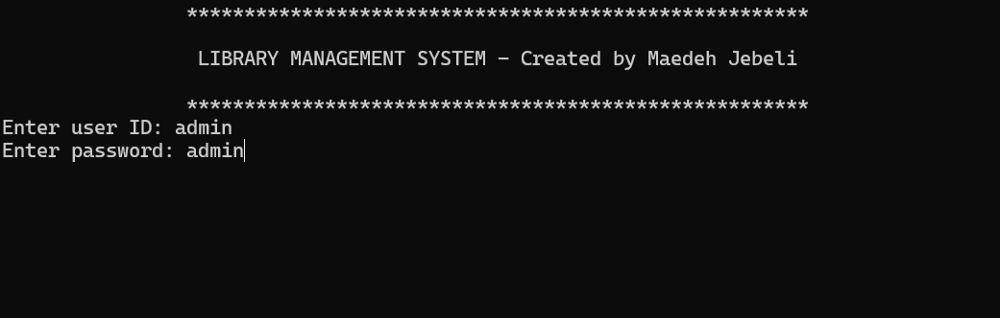
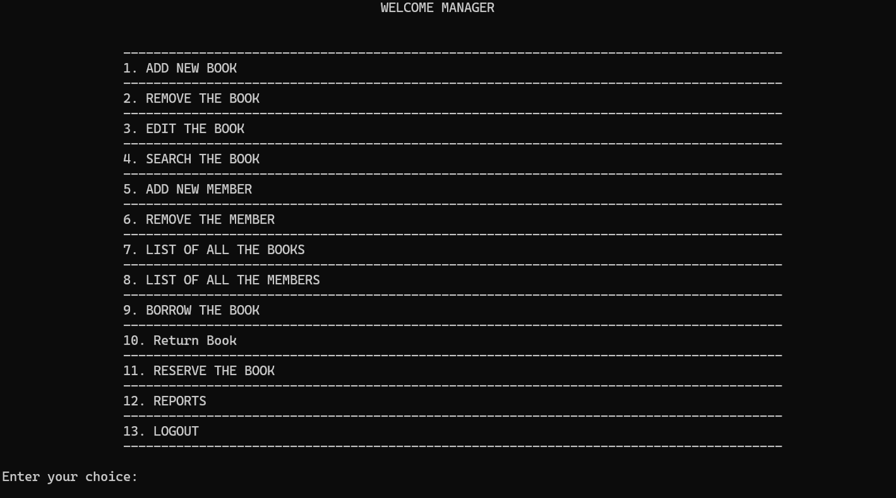

# library-management-cpp
A simple library management system written in C++ with features like adding, searching, deleting, and listing books and users.
# 📚 Library Management System (C++)

A simple console-based Library Management System built in **C++**.  
This project manages books, members, borrowing, and returning using basic file handling.

  


## 🚀 Features

- Add, edit, and remove books
- Register and manage members
- Borrow and return books
- Track borrowed books and transactions
- File-based data storage (no database needed)

## 🛠 Technologies

- **Language**: C++
- **Storage**: Text files (`.txt`)

## 📁 Project Structure
.
├── library-management.cpp # Main application file
├── data/
│ ├── books.txt
│ ├── members.txt
│ ├── borrowed_books.txt
│ ├── transactions.txt
├── screenshots/
│ ├── screenshot1.png
│ └── screenshot2.png
├── .gitignore
└── README.md

## 🧪 How to Run
1. Clone the repository:
   ```bash
   git clone https://github.com/mdhjbl/library-management-cpp.git
Compile the project:
g++ library-management.cpp -o library-management

Run the executable:
./library-management
